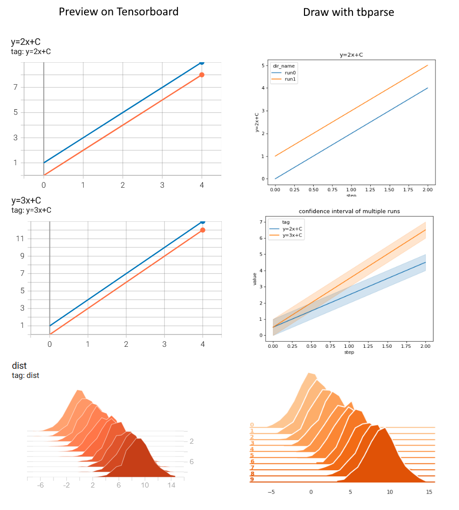

# tbparse

[](https://github.com/j3soon/tbparse/actions/workflows/test-with-tox.yaml)
[](https://github.com/j3soon/tbparse/actions/workflows/publish-to-pypi.yaml)
[](https://tbparse.readthedocs.io/en/latest)
[](https://codecov.io/gh/j3soon/tbparse)
[](https://pypi.org/project/tbparse/)
[](https://pypi.org/project/tbparse/) [](https://pepy.tech/project/tbparse)

A simple yet powerful tensorboard event log parser/reader.

* Supports parsing tensorboard event [scalars](https://tbparse.readthedocs.io/en/latest/pages/parsing-scalars.html), [tensors](https://tbparse.readthedocs.io/en/latest/pages/parsing-tensors.html), and [histograms](https://tbparse.readthedocs.io/en/latest/pages/parsing-histograms.html).
* Supports event generated by
  [PyTorch](https://pytorch.org/docs/stable/tensorboard.html), [Tensorboard/Keras](https://www.tensorflow.org/tensorboard), and [TensorboardX](https://github.com/lanpa/tensorboardX), with their respective usage examples documented in detail.
* Allows parsing multiple tensorboard event files in a hierarchical directory structure.
* Provides plotting examples for each type of events.
* Stores the data in [pandas.DataFrame](https://pandas.pydata.org/pandas-docs/stable/reference/api/pandas.DataFrame.html) to allow advanced filtering.
* Both the documentation and code have high test coverage rate.
* Follows [PEP 484](https://www.python.org/dev/peps/pep-0484/) with full type hints.

Installation: (Requires python >= 3.7)

```sh
pip install -U tbparse
```

We suggest using an additional virtual environment for parsing and plotting the tensorboard events. So no worries if your training code uses Python 3.6 or older versions. 

Reading one or more event files with tbparse only requires 5 lines of code:

```py
from tbparse import SummaryReader
log_dir = "<PATH_TO_EVENT_FILE_OR_DIRECTORY>"
reader = SummaryReader(log_dir)
df = reader.scalars
print(df)
```

For beginners, start from the page: [Parsing Scalars](https://tbparse.readthedocs.io/en/latest/pages/parsing-scalars.html).

Currently, tbparse enables parsing native types (scalars, tensors, histograms, etc.) easily. More event types will be supported in future versions.



## Installation

```sh
pip install -U tbparse
```

(Requires python >= 3.7)

## Testing the Source Code

Test source code:

```sh
python3 -m pip install tox
python3 -m tox
```

Test and build documentation:

```sh
cd docs
make clean
# sphinx-tabs seems to require html be built before doctest
make html
make doctest
```

Generate test coverage:

```sh
python3 -m pip install pandas tensorflow torch tensorboardX pytest pytest-cov
python3 -m pytest --cov=./ --cov-report html
```
